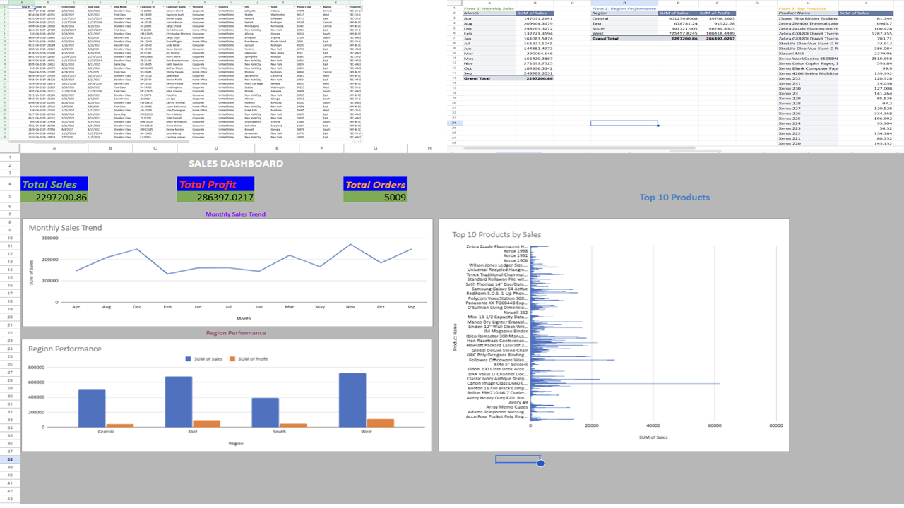

# Sales Dashboard Project

## Project Overview

This project demonstrates the creation of an interactive Sales Dashboard using Excel/Google Sheets and the Superstore dataset.

The objective was to analyze sales performance, profitability, product performance, and regional trends through KPI calculations, pivot tables, and visualizations.

--

## Dataset

Source: Superstore Dataset

Key fields used:

* Order Date
* Sales
* Profit
* Product Name
* Region
* Quantity

---

## KPIs

The dashboard tracks:

* Total Sales
* Total Profit
* Monthly Sales Trend
* Top Products
* Region Performance

---

## Skills Demonstrated

### Data Cleaning

* Handling missing values
* Data validation
* Formatting and standardization

### Data Analysis

* Pivot Tables
* Aggregations
* Business KPI calculations

### Data Visualization

* Line Charts
* Clustered Column Charts
* Horizontal Bar Charts

### Dashboard Design

* KPI Cards
* Interactive Layout
* Business Reporting

---

## Dashboard Preview

---

## Tools Used

* Excel / Google Sheets
* Pivot Tables
* Charts
* GitHub

---

## Business Insights

* Identified top-performing products.
* Analyzed monthly sales trends.
* Compared regional performance.
* Evaluated overall profitability.

---

## Project Files

* Superstore_Dashboard.xlsx
* sales-dashboard-project.png

---

## Author

Divya Sree Billa

Aspiring Data Analyst | Excel | SQL | Power BI | Python
